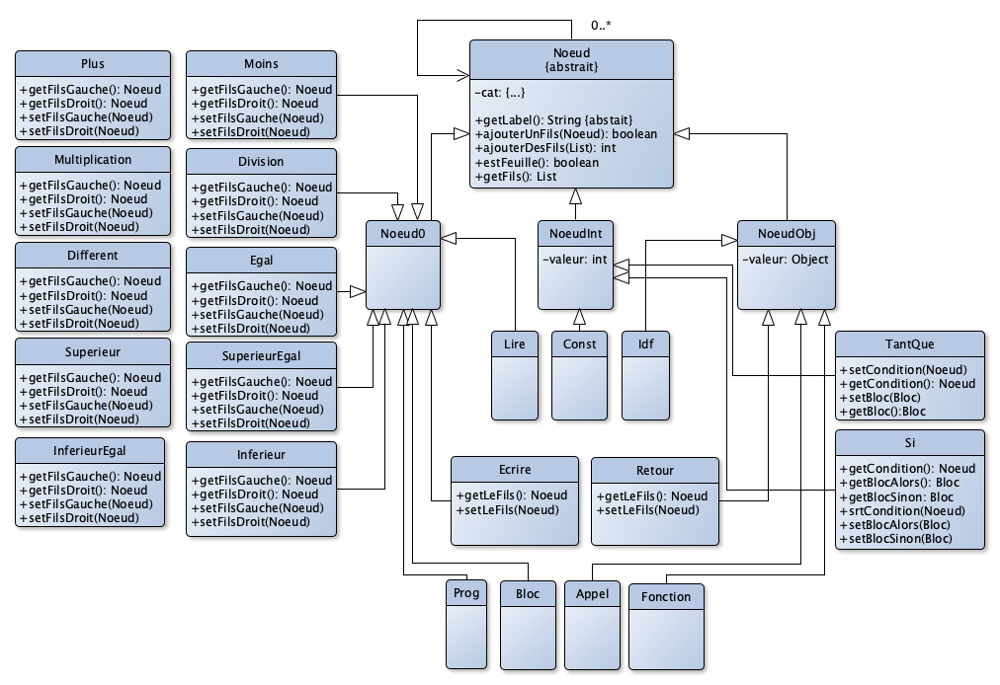

# Package arbre

## Description

Ce projet contient un package JAVA de gestion d'arbres n-aire 
adaptés à la représentation de la structure de données arbre abstrait
du projet de réalisation d'un compilateur dans le cadre du cours de Compilation
en Licence MIASHS parcours MIAGE et TAL à l'Université de Lorraine

## Capture d'écran
```
% ./tester 4
SI/1
└─INF
  └─IDF/j
  └─IDF/k
└─BLOC
  └─AFF
    └─IDF/i
    └─CONST/10
└─BLOC
```

## Utilisation

Voici un exemple de code en Java qui crée un arbre abstrait et qui l'affiche à la suite

```java
Idf idf41 = new Idf("j");
Idf idf42 = new Idf("k");
Inferieur inf4 = new Inferieur();
inf4.setFilsGauche(idf41);
inf4.setFilsDroit(idf42);
Idf idf43 = new Idf("i");
Const const41 = new Const(10);
Affectation aff41 = new Affectation();
aff41.setFilsGauche(idf43);
aff41.setFilsDroit(const41);
Bloc bloc4 = new Bloc();
bloc4.ajouterUnFils(aff41);
Si si4 = new Si(1);
si4.setCondition(inf4);
si4.setBlocAlors(bloc4);
TxtAfficheur.afficher(si4);
```

##Diagramme des classes



## Prérequis

Utiliser un IDE qui intègre Maven (par exemple Eclipse)

## Installation

1. Télécharger la distribution .zip depuis le [gitlab de l'Université de Lorraine](https://gitlab.univ-lorraine.fr/roussana5/arbre)
2. Décompresser dans un dossier
3. Importer le projet dans votre IDE (pour Eclipse : `File>Import...>Existing Maven Project...`
4. Installer dans le repository local (pour Eclipse: `Run As...>Maven Install`

## Exécution du projet

Pour compiler et exécuter correctement le projet avec Maven, suivez les étapes suivantes :

1. Nettoyer le projet :
```
mvn clean
```

2. Compiler le code source :
```
mvn compile
```

3. Générer le package (JAR) :
```
mvn package
```

4. Installer le projet dans le repository local :
```
mvn install
```

Ces commandes permettent respectivement de nettoyer les anciens fichiers, compiler le projet, générer l’artefact et le rendre disponible pour d’autres projets Maven.

## Distribution binaire

Une distribution binaire du projet est fournie dans le dossier `bindist/`.

Pour exécuter le compilateur avec la grammaire que vous avez créée, suivez les étapes suivantes dans un terminal :

1. Se placer dans le dossier contenant l’exécutable :
```
cd bindist/bin
```

2. Lancer l’analyse d’un exemple :
```
./parse ../../samples/Exemple1
```

3. Vous pouvez tester les différents exemples fournis :
```
./parse ../../samples/Exemple2
./parse ../../samples/Exemple3
...
./parse ../../samples/Exemple9
```

Ces commandes permettent d’exécuter directement le compilateur sans passer par Maven, en utilisant les fichiers d’exemples fournis.

## Utilisation

Dans un projet Maven, ajouter la dépendance suivante dans le fichier `pom.xml` :

```
		<dependency>
			<groupId>fr.ul.miage</groupId>
			<artifactId>arbre</artifactId>
			<version>0.0.7</version>
		</dependency>

```
##Auteur

Azim Roussanaly (IDMC/Université de Lorraine)

##Licence

Licence MIT